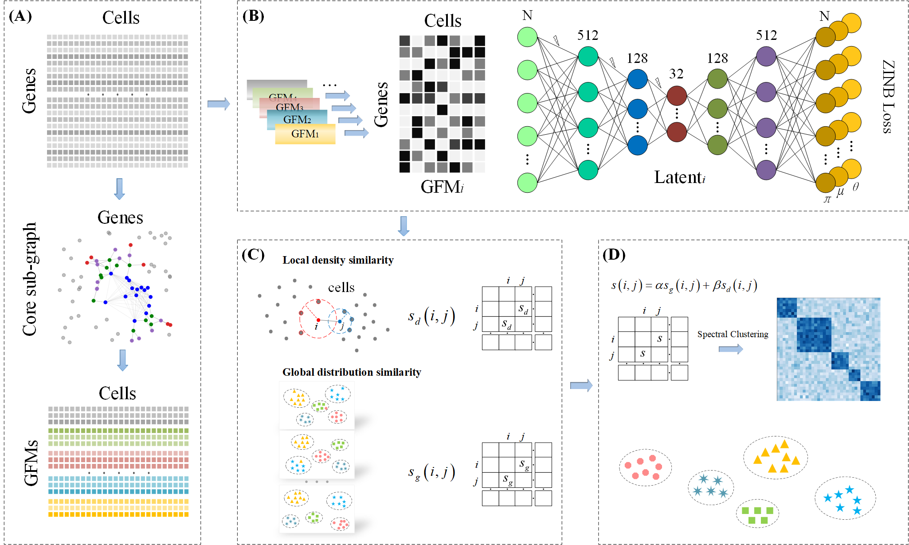

# scMUG: Deep clustering analysis of single-cell RNA-seq data on multiple gene functional modules


# Overview

Single-cell RNA sequencing (scRNA-seq) has revolutionized our understanding of cellular heterogeneity by providing gene expression data at the single-cell level. Unlike bulk RNA-seq, scRNA-seq allows identification of different cell types within a given tissue, leading to a more nuanced comprehension of cell functions. However, the analysis of scRNA-seq data presents challenges due to its sparsity and high dimensionality. To address these challenges, we introduce the scMUG pipeline, which incorporates gene functional module (GFM) information to enhance scRNA-seq clustering analysis. The pipeline includes data preprocessing, cell representation generation, cell-cell similarity matrix construction, and clustering analysis. The scMUG pipeline also introduces a novel similarity measure that combines local density and global distribution in the latent cell representation space. As far as we can tell, this is the first attempt to integrate gene functional associations into scRNA-seq clustering analysis. We curated nine human scRNA-seq datasets to evaluate our scMUG pipeline. With the help of gene functional information and the novel similarity measure, the clustering results from scMUG pipeline present deep insights into functional relationships between gene expression patterns and cellular heterogeneity. In addition, our scMUG pipeline also presents comparable or better clustering performances than other state-of-the-art methods. 

# Flowchart 

 

Flowchart of scMUG. (A) Raw scRNA-seq data was preprocessed with statistical filters. Gene co-expression network was established using filtered expression profiles. Core sub-graphs were extracted. GFMs(Gene Functional Modules) were identified. (B) Cell representations are established by ZINB-loss based autoencoders in every GFM respectively. (C) Constructing cell-cell global distribution similarity matrix and local density similarity matrix. (D) Cell clustering analysis by spectral clustering with the combination of global and local similarity.

# Installation

1. Requirements

   ```bash
   anndata==0.10.7
   h5py==3.11.0
   joblib==1.4.2
   louvain==0.8.2
   numpy==1.26.4
   pandas==2.2.2
   pillow==10.3.0
   scanpy==1.10.1
   scikit-learn==1.5.0
   scipy==1.13.1
   seaborn==0.13.2
   torch==2.3.1+cu118
   torchaudio==2.3.1+cu118
   torchvision==0.18.1+cu118
   umap-learn==0.5.6
   CSCORE==1.0.0
   locCSN==0.0.12
   omicverse==1.6.10
   ```

2. Installtion

   ```bash
   # clone scMUG source code
   git clone https://github.com/degiminnal/scMUG.git
   
   # create conda environment
   conda create -n scMUG python=3.10
   
   # activate environment
   conda activate scMUG
   
   # install all required packages
   pip install -r requirements.txt
   
   # exit environment
   conda deactivate
   ```

3. Install gcorr

   ```bash
   # Compile gcorr
   cd ./gcorr 
   nvcc -o gcorr gcorr.cu --shared
   
   # Add ./gcorr to system LD_LIBRARY_PATH
   export LD_LIBRARY_PATH=/home/xxxx/scMUG/gcorr:$LD_LIBRARY_PATH
   
   # Add ./gcorr to PYTHONPATH
   export PYTHONPATH=/home/xxxx/scMUG/gcorr:$PYTHONPATH
   ```

4. Use gcorr to calculate PCC

   

# Usage

Command Lines:

```bash
python scMUG.py [--dataset DATASET_NAME] [--cluster_number CLUSTER_NUMBER] [--seeds SEEDS]
				[--repeat REPEAT] [--n_gfm GFM_NUMBER] [--cutoffs GFM_CUTOFFS] [--epoch EPOCH]
				[--n_neighbour NEIGHBOUR_NUMBER] [--kmeans_times KMEANS_TIMES] 
				[--red_global GLOBAL_REDUCTION_METHOD] [--red_local LOCAL_REDUCTION_METHOD]
				
optional arguments:
  dataset: The dataset used in this experiment
  cluster_number: Specify number of clusters, it will be the real number of clusters if not specified.
  seeds: Random seeds
  repeat: The number of repetitions with the same random seed
  n_gfm: The number of GFMs
  cutoffs: The cutoff value of correlation coefficient in each GFM. It should be pre-calculated.
  epoch: The number of times the autoencoder is trained repeatedly.
  n_neighbour: The number of neighbours when calculating local density similarity.
  kmeans_times: The kmeans times when calculating global distribution similarity.
  red_global: Processing method before extracting global similarity.
  red_local: Processing method before extracting local similarity.
```

Example:

```bash
python3 scMUG.py --dataset muraro --cluster_number 7 --n_gfm 5 --cutoffs 0.14,0.14,0.15,0.14,0.14 --seeds 1111,2222,3333,4444,5555,6666,7777,8888,9999,10000
```

# File descriptions

| File              | Description                                                  |
| ----------------- | ------------------------------------------------------------ |
| accelerate.py     | Functions for accelerating the calculation of local and global similarity |
| model.py          | Autoencoder, including ZINB loss function and NB loss function |
| scMUG.py          | Program entry function                                       |
| utils.py          | Function tools, including data loader、visualization function、benchmark function、preprocessing method, and GFM related functions |
| Tutorial.ipynb | Documentation describing the usage instructions for sMUG |
| gcorr/\__init\__.py | The gcorr package used for calculating pearson correlation coefficient |
| gcorr/gcorr.cu | Source code for compiling dynamic link libraries for computing pearson correlation coefficien |
| others | Others tools used in this work |

# Result

The results are saved in the "./outputs/" folder, including the latent value, the predicted labels, and the benchmark results measured by ACC, ARI and NMI.

